# Chronos

**Plugin-based industrial IoT data-collection & historian platform.**

Chronos periodically collects from diverse industrial sources (SQL databases, files, shell commands,
MQTT, Modbus, TCP, HTTP), normalizes everything into per-node **Tag(Key)–Value**
pairs, stores a per-node local time series (**Time Machine**), and lets external programs subscribe
to live values over a **WebSocket + protobuf gateway** with Java / Python / .NET SDKs.

Data flows are authored visually in a **Node-RED-style flow editor** — drag nodes from a categorized
palette, wire them, and deploy. New protocols are added as **PF4J plugins** without touching the core.

<p align="center">
  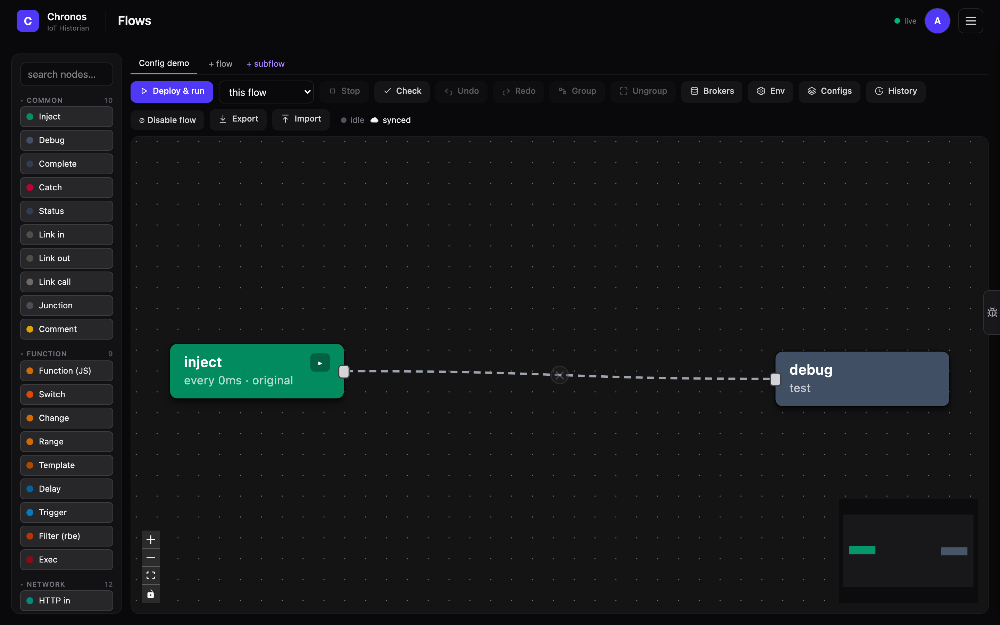
</p>
<p align="center"><em>The Flows editor — Chronos's primary authoring surface.</em></p>

> Design & rationale: [`docs/architecture.md`](docs/architecture.md) ·
> Extending it: [`docs/adding-a-protocol.md`](docs/adding-a-protocol.md) ·
> Security posture: [`docs/security.md`](docs/security.md)

---

## Table of contents

- [Screens — a visual tour](#screens--a-visual-tour)
- [Architecture](#architecture)
- [Tech stack](#tech-stack)
- [Quick start (Docker)](#quick-start-docker)
- [Local development](#local-development)
- [Configuration](#configuration)
- [Ports](#ports)
- [Build your first flow](#build-your-first-flow)
- [Node reference](#node-reference)
- [Project layout](#project-layout)
- [Build & test](#build--test)
- [Security](#security)

---

## Screens — a visual tour

A single web admin UI at **http://localhost:8088**. Switch views from the hamburger menu
(**Dashboard · Flows · Devices · Tags · Time Machine · Logs**); the bug icon on the right edge opens
the **Inspector**. Everything is **code-split** — the flow canvas, charts, and code editor load on
demand — and the frontend polls live data so the numbers move on their own.

### Sign in

JWT-backed auth with three roles. Your role drives **RBAC**: reads need any role, operational actions
need OPERATOR+, and all config writes need ADMIN — the UI disables controls your role can't use.

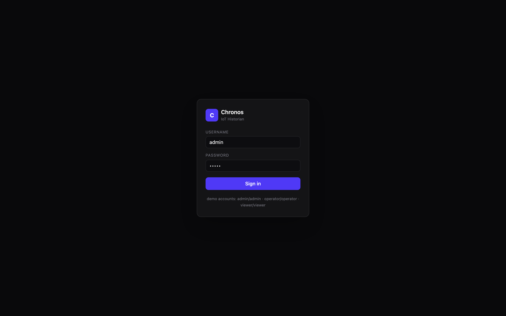

### Dashboard — everything at a glance

Top **KPI cards** (success rate, total collections, live-value count, device count), a large
**live-values table** (tag · value · quality), and a right rail of **device / node / task** inventory.
It's a single screen with per-panel scrolling and a 5-second auto-refresh.

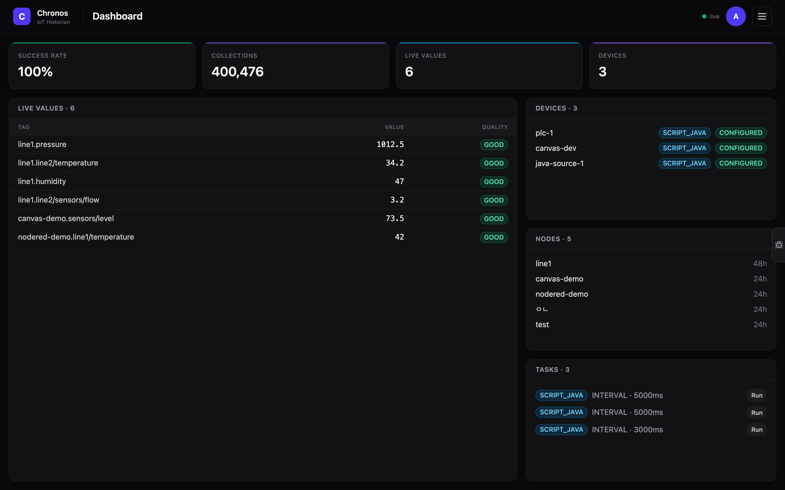

### Flows — the visual editor (primary authoring surface)

A Node-RED-style canvas. Drag nodes from the **left palette** onto the canvas, **wire** outputs to
inputs, **double-click** a node to configure it, and **Deploy & run** from the toolbar.

- The palette is grouped into collapsible, searchable categories — **Common / Function / Network /
  Sequence / Parser / Storage**.
- Toolbar: Deploy target (this / all / modified), Stop, Check (validate), Undo/Redo, Group, Brokers,
  Env, Configs, History, Disable, Export/Import.
- Delete a wire with the **✕** at its midpoint; the bottom-right **minimap** colors nodes by type.


<details>
<summary><strong>Palette close-up</strong> — the categorized, searchable node rail</summary>

<p align="center">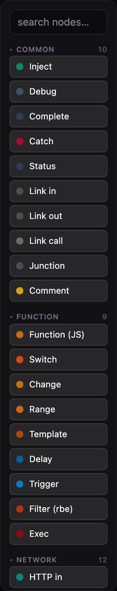</p>

</details>

### Devices — data sources & connection pools

Register global data sources once, test their connections, and monitor **live connection pools**.

- **Devices** — the registered sources (adapter · status), `Test` (probe the connection), delete.
- **Connection pools** — active / idle / total / max connections per pool (3-second refresh); a
  warning shows if requests start waiting.
- **Scheduled collection tasks** — the Quartz-scheduled pulls, with `Run` (fire now) / delete.
- **New device** — register a source. JDBC gets dedicated fields (jdbcUrl / credentials / max pool);
  others use `params` / `secrets` (JSON).

Register a device once, then reference it from flow `device read` nodes so every node and task sharing
that source **shares one bounded pool** — no per-node session sprawl.

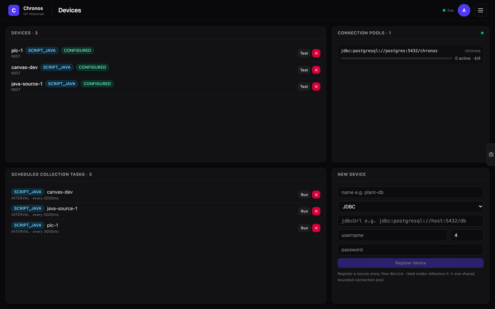

### Tags — the tag tree & live values

Tag names split on `/` into an **Obsidian-style folder tree** with live values alongside. Drag a tag
between folders (ADMIN); create **storage nodes** (retention groups) and **tags** on the right.

- Put `/` in a tag name to create folders (e.g. `line2/sensors/flow`).
- A storage node bundles tags and sets their Time Machine retention (in hours).

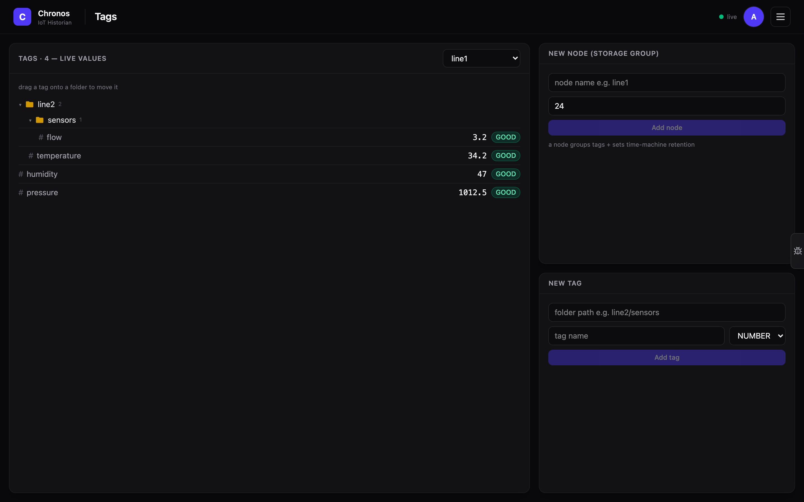

### Time Machine — query the past

A left-hand **snapshot** (a 24-hour slider that shows every tag's value at a chosen instant) beside a
right-hand **range chart** (a single tag's last 24 hours, drawn with ECharts) over the per-node history
store.

- Drag the slider and the snapshot table jumps to that moment in time.
- Pick the charted tag from the top-right dropdown.

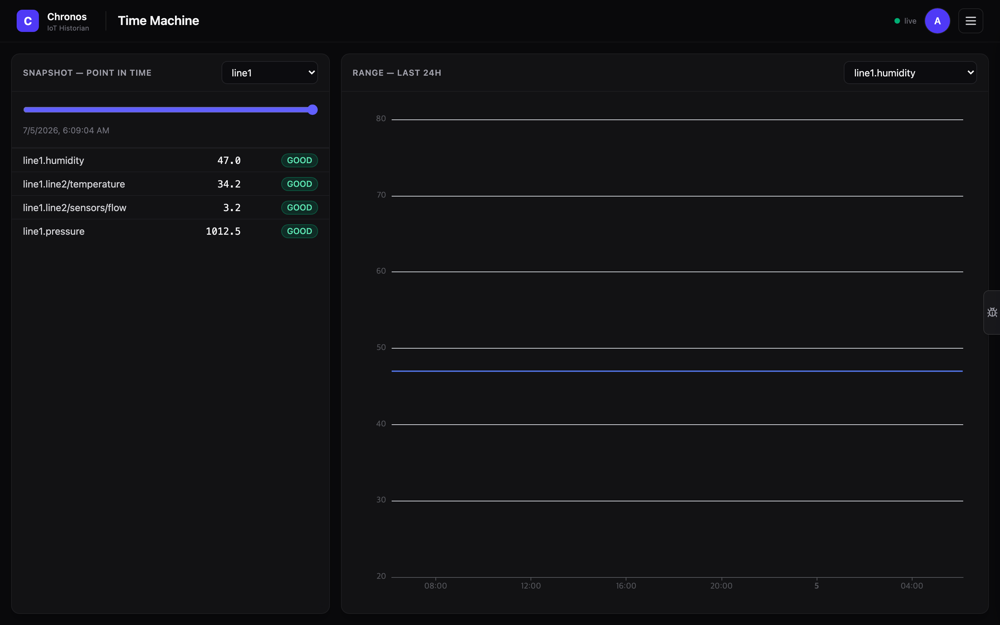

### Inspector — debug & context side panel

The bug icon on the right edge slides out a panel with tabs:

- **Debug** — messages that reached a `debug` node, newest first; objects render as a **collapsible
  JSON tree** (JSON strings are auto-parsed). Filter by topic / value.
- **System** — flow deploy history + collection-run log (pipeline health).
- **Info** — the type, help and settings of the node selected on the canvas.
- **Context** — variables a Function node stored via `flow.set` / `global.set`.

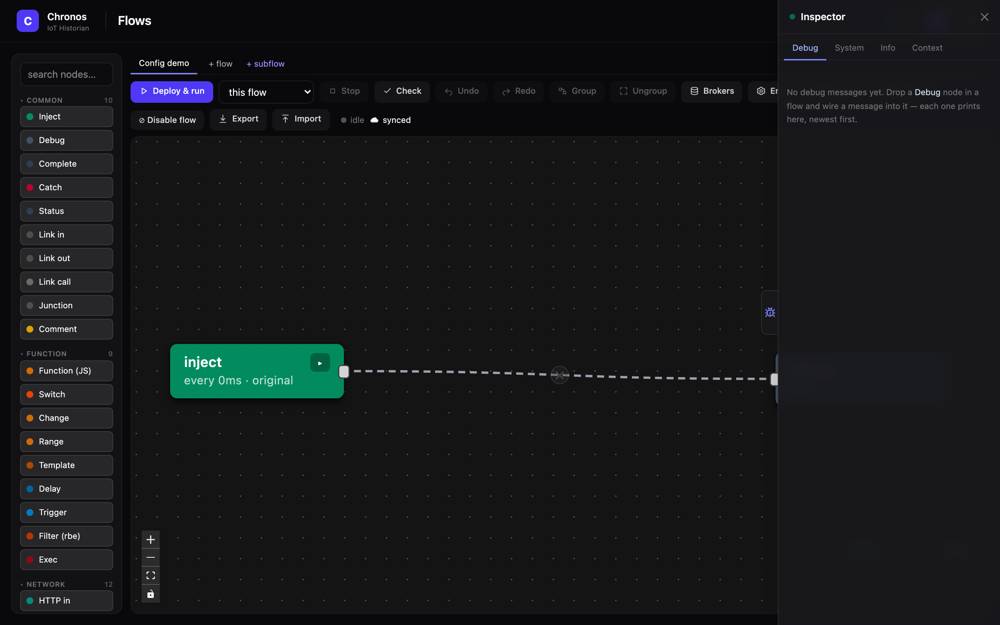

### Logs

Collection-run history — success / failure, duration, tag count and error for every scheduled or
manual collection. (This is the one view that uses page scrolling.)

---

## Architecture

Chronos is a **Gradle multi-module** backend plus a React SPA, wired together only over REST + WS.

```
                 ┌──────────────────────────────────────────────┐
   Browser ───►  │  frontend (nginx)  ── /api ─┐  ── /ws ─┐      │
                 └──────────────────────────────┼──────────┼─────┘
                                                ▼          ▼
                 ┌─────────────────────────────────────────────────────────┐
                 │  app (Spring Boot)                                       │
                 │   REST API · JWT/RBAC security · Quartz scheduler        │
                 │   Flow runtime  ·  WebSocket gateway (protobuf)          │
                 │   ┌──────────────┐  ┌───────────────┐  ┌──────────────┐  │
                 │   │ core-engine  │  │  core-flow    │  │  PF4J plugins│  │
                 │   │ collection   │  │ flow graph +  │  │  adapter-*   │  │
                 │   │ pipeline +   │  │ node runtime  │  │  (protocols) │  │
                 │   │ history store│  └───────────────┘  └──────────────┘  │
                 │   └──────┬───────┘                                       │
                 └──────────┼─────────────────────────────────────────────-┘
                            ▼
           PostgreSQL (metadata + flows)  ·  SQLite per-node (time series)
```

**Modules**

| Module | Responsibility |
|--------|----------------|
| `core-api` | Pure-JDK SPI: `DeviceAdapter`, `TagValue`, `HistoryStore`, plugin contracts. |
| `core-engine` | Collection pipeline (adapter → parse → ingest), current-value cache, SQLite history store, tag broadcast. |
| `core-flow` | Framework-free flow runtime: `FlowGraph`, `FlowNode` SPI, single-threaded worker, all node implementations. |
| `app` | Spring Boot: REST controllers, JWT/RBAC security, Quartz scheduling, flow deploy/runtime manager, WebSocket gateway host, Flyway/JPA persistence. |
| `gateway` | Framework-free WebSocket + protobuf broadcaster (token auth, gzip framing, per-tag subscriptions). |
| `adapters/adapter-*` | PF4J protocol plugins — `jdbc`, `file`, `shell`, `script`, `mqtt`, `modbus`, `tcp` (+ `adapter-api` contract). |

**Storage split** — metadata (devices, nodes, tags, tasks, mappings, users, saved flows) lives in
**PostgreSQL** (schema managed by **Flyway**); the time-series history for each node is a local
**SQLite** database under `CHRONOS_HISTORY_DIR` (the "Time Machine").

**Core concepts**

| Term | Meaning |
|------|---------|
| **Device** | One data source (DB / file / MQTT / …). Registered globally and reused; credentials encrypted at rest. |
| **Node** | A *storage* group for tags (the retention unit) — distinct from a *flow* node. |
| **Tag** | A single value keyed `node.tag` (e.g. `line1.temp`), stored as a time series. |
| **Task** | A Quartz-scheduled collection job that reads a device periodically. |
| **Flow** | A graph of wired nodes that processes data; runs in the runtime once deployed. |
| **Time Machine** | The per-node local SQLite time-series store (snapshot / range queries). |
| **Gateway** | The WebSocket + protobuf endpoint external clients subscribe to by tag name. |

---

## Tech stack

**Backend**

- **OpenJDK 17** (Gradle toolchain-pinned) · **Kotlin-DSL Gradle** multi-module build
- **Spring Boot 4.0.7** (Spring Framework 7) — REST, Security, Data JPA, Quartz, WebSocket
- **PostgreSQL 16** + **Flyway** migrations · **SQLite** per-node time series
- **PF4J 3.15** — protocol adapters as hot-pluggable plugins
- **GraalVM JS (`js-community` 24.1.1)** — sandboxed JavaScript Function node (`HostAccess.NONE`)
- **Eclipse Paho** (MQTT) · **Jackson** (JSON) · **SnakeYAML** · **jsoup** (HTML) · **JGit** (flow versioning)
- **protobuf** + WebSocket for the streaming gateway
- **JWT (HS256)** auth · **AES-GCM** encryption of secrets at rest
- **Micrometer / Prometheus** metrics · **OpenTelemetry → Jaeger** tracing (opt-in)

**Frontend**

- **React 19** + **TypeScript** + **Vite** · **pnpm**
- **Tailwind CSS v4** (design system in `ui/kit.tsx`)
- **@xyflow/react (React Flow) 12** — the flow canvas
- **TanStack Query 5** — server state / polling
- **CodeMirror 6** (`@uiw/react-codemirror`, `lang-javascript`, `lint`) — the Function-node editor
- **Apache ECharts 6** — time-series charts
- **Biome** (lint/format) · **Vitest** + Testing Library (tests)

**Infra**

- **Docker Compose** — postgres · mosquitto (MQTT) · backend · frontend (nginx) · otel-collector · jaeger
- **SDKs**: `sdk/sdk-java`, `sdk/sdk-python`, `sdk/sdk-dotnet` (subscribe to tags over the gateway)

---

## Quick start (Docker)

The fastest path — builds the backend jar, then brings up the whole stack:

```bash
./gradlew :app:bootJar        # build the Spring Boot jar
docker compose up --build     # postgres + mosquitto + backend (:8080) + frontend (:8088)
```

Then open **http://localhost:8088** and sign in.

**Demo accounts** (JWT-backed):

| User | Password | Role |
|------|----------|------|
| `admin` | `admin` | ADMIN |
| `operator` | `operator` | OPERATOR |
| `viewer` | `viewer` | VIEWER |

Gateway subscription token (SDKs): `chronos-dev-token`.

> ⚠️ These are development defaults. Override every secret via env vars (see
> [Configuration](#configuration)) before any real deployment.

### Observability (opt-in)

Prometheus metrics are always exposed at `/actuator/prometheus`. Full OpenTelemetry tracing
(OTLP → Collector → Jaeger) is behind a profile:

```bash
OTEL_ENABLED=true docker compose --profile observability up -d --build
# Jaeger UI: http://localhost:16686   (service "chronos")
```

---

## Local development

**Prerequisites:** OpenJDK 17, Node 24+ with Corepack (for pnpm), Docker (for Postgres + the
Testcontainers-based tests).

Run the backend against a local Postgres:

```bash
docker compose up -d postgres           # metadata DB on :5432
./gradlew :app:bootRun                  # Spring Boot app on :8080

curl localhost:8080/actuator/health     # -> {"status":"UP"}
curl localhost:8080/api/info            # -> {"name":"chronos", ...}
```

Run the frontend dev server (hot reload; proxies `/api` and `/ws` to `:8080`):

```bash
cd frontend
corepack enable
pnpm install
pnpm dev                                # http://localhost:5173
```

---

## Configuration

Everything is environment-driven. Key variables (see `docker-compose.yml` for the full set and
their development defaults):

| Variable | Purpose |
|----------|---------|
| `CHRONOS_DB_URL` / `CHRONOS_DB_USER` / `CHRONOS_DB_PASSWORD` | PostgreSQL metadata database. |
| `CHRONOS_API_USER` / `CHRONOS_API_PASSWORD` | Bootstrap admin account. |
| `CHRONOS_JWT_SECRET` | HS256 signing secret (**≥ 32 bytes**; stable so JWTs survive restarts). |
| `CHRONOS_SECRET_KEY` | AES key that encrypts device/flow secrets at rest (base64, 32 bytes). |
| `CHRONOS_GATEWAY_TOKEN` | Token the WebSocket/SDK clients present to subscribe. |
| `CHRONOS_HISTORY_DIR` | Directory for the per-node SQLite time-series files (Time Machine). |
| `CHRONOS_PROJECTS_DIR` | Git repositories for flow versioning (Projects). |
| `CHRONOS_FLOW_FILES_DIR` | Sandbox directory the `file in` / `file out` flow nodes are confined to. |

Under the `prod` Spring profile the app **refuses to start** if `CHRONOS_JWT_SECRET` or
`CHRONOS_SECRET_KEY` is left at a blank/dev default.

---

## Ports

| Service | Port | Notes |
|---------|------|-------|
| Frontend (nginx) | **8088** | the web UI |
| Backend (Spring Boot) | 8080 | REST `/api`, WebSocket `/ws`, `/actuator/*` |
| PostgreSQL | 5432 | metadata |
| Mosquitto (MQTT broker) | 1883 | for MQTT flow nodes / adapter |
| OTel Collector | 4318 / 8889 | OTLP HTTP in / Prometheus scrape |
| Jaeger UI | 16686 | traces (observability profile) |

---

## Build your first flow

The minimal historian pipeline — **read a value from a source → store it in a tag → see it on
screen**. This example reads a temperature from a JDBC database into the `line1.temp` tag.

**1. Register a device** (Devices → **New device**): name `plant-db`, adapter `JDBC`,
`jdbcUrl` `jdbc:postgresql://host:5432/db`, credentials, max pool `4` → **Register device** →
**Test** (status `OK`). Its pool appears under *Connection pools*.

**2. Create a storage node & tag** (Tags): **New node** `line1`, retention `48` (hours) →
**Add node**; then **New tag** name `temp`, type `NUMBER` → **Add tag**. This creates the
`line1.temp` tag (its canonicalKey).

**3. Author the flow** (Flows) — drag and wire:

```
inject ─▶ device read ─▶ function ─▶ tag ─▶ debug
```

- **inject** — interval `2000` (every 2 s) or `0` (manual ▸ only). The timer.
- **device read** — pick `plant-db` in the **device** dropdown (shared pool), `sql` =
  `SELECT temp FROM sensor`, task type `QUERY`.
- **function (JS)** — pull one value out into the payload:
  ```js
  // device read emits an array of rows → take the first row's temp
  msg.payload = msg.payload[0].temp;
  return msg;
  ```
- **tag** — `line1.temp` (the canonicalKey from step 2).
- **debug** — to watch the flow in the Inspector.

**4. Deploy & run** — click **Deploy & run**. If `inject`'s interval is `0`, fire it manually with the
node's **▸** button (only fires while the flow is deployed); at `2000` it auto-collects every 2 s.

**5. Watch it flow** — open the Inspector (bug icon) → **Debug** tab; each message arrives newest-first
and objects expand as a JSON tree.

**6. See stored data** — the **Dashboard** current-values table shows `line1.temp`; **Time Machine**
scrubs a point-in-time snapshot and charts its last 24 h.

**7. Consume externally** — a gateway client (Java/Python/.NET SDK) presents `CHRONOS_GATEWAY_TOKEN`,
subscribes by tag name over the WebSocket, and receives compressed protobuf frames on each update.

> **Common gotchas** — `inject ▸` does nothing if the flow isn't **deployed** (deploy first). A `tag`
> node erroring with *"no historian tag"* means the tag wasn't created in **Tags** yet. If a
> `device read` opens its own connection, pick a **registered device** (not inline) so the pool is
> shared.

**No hardware handy?** [`docs/examples/synthetic-demo.md`](docs/examples/synthetic-demo.md) builds a
JS-only flow (`inject → function → tag`) that synthesizes moving live values — no device adapter needed.

---

## Node reference

Every flow node and its configuration dialog. Double-click a node on the canvas to open the dialog
shown here; common controls at the bottom of every dialog are **enabled** (skip on deploy),
**shared config**, and **Delete / Done**.

<details>
<summary><strong>Common</strong> — entry points, debug, error/status hooks, virtual wires</summary>

<table>
<tr>
<td width="320">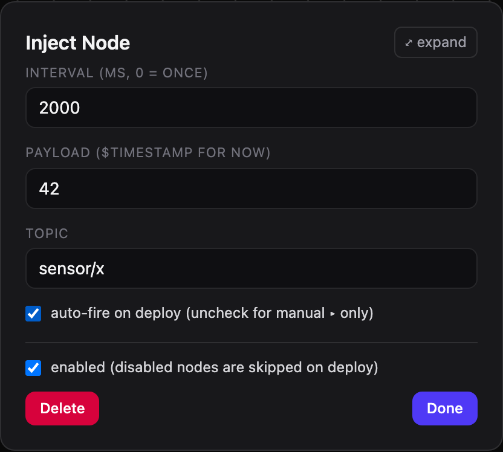</td>
<td><b><code>inject</code></b> — Flow entry point. Fires a message every <code>interval</code> ms, or manually via the node's <b>▸</b> button (uncheck <i>auto-fire on deploy</i> for manual-only). The trigger for every poll — place it before <code>device read</code> / <code>http request</code>.</td>
</tr>
<tr>
<td width="320">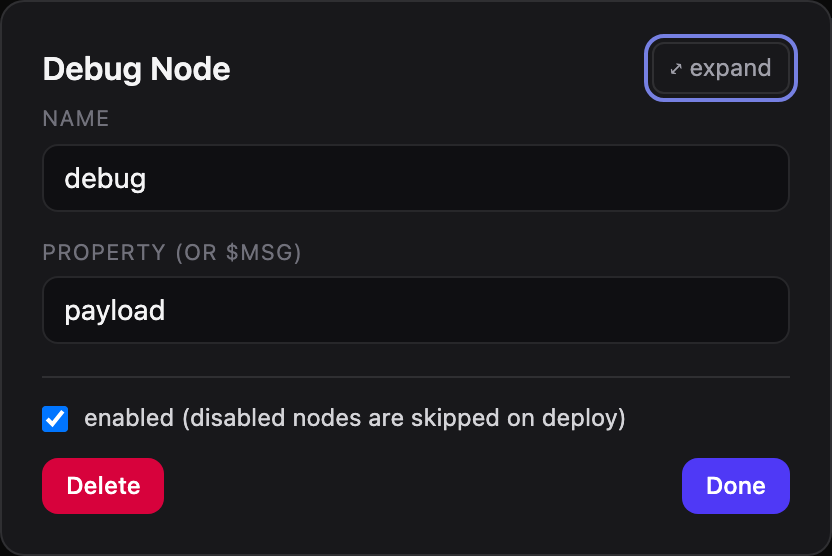</td>
<td><b><code>debug</code></b> — Prints incoming messages to the Inspector's <b>Debug</b> tab; objects render as a collapsible JSON tree. A sink (no output) — branch it in anywhere.</td>
</tr>
<tr>
<td width="320">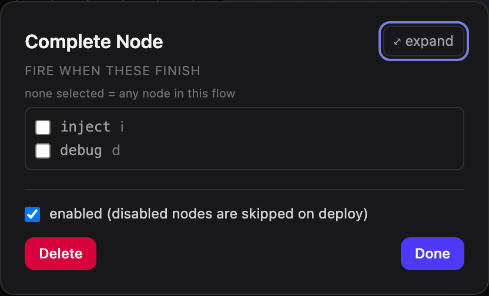</td>
<td><b><code>complete</code></b> — Fires when a watched node <i>finishes</i> handling a message — a post-processing hook (e.g. "notify once storage is done").</td>
</tr>
<tr>
<td width="320">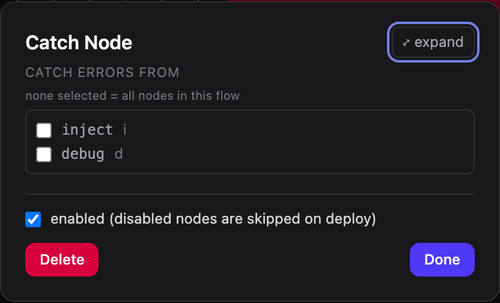</td>
<td><b><code>catch</code></b> — Catches errors thrown by watched nodes (details in <code>msg.error</code>) for error handling / alerting / fallback values.</td>
</tr>
<tr>
<td width="320">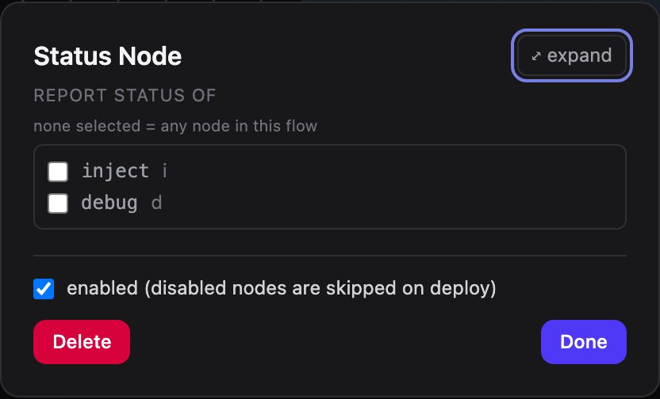</td>
<td><b><code>status</code></b> — Receives status events from watched nodes (<code>msg.status</code>), e.g. "broker connected / disconnected".</td>
</tr>
<tr>
<td width="320">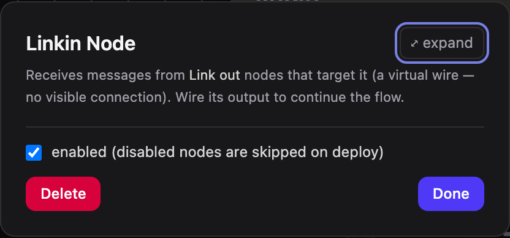</td>
<td><b><code>Link in</code></b> — Receives messages a <code>Link out</code> sends over a virtual wire (jump with no drawn line) — keeps the canvas tidy.</td>
</tr>
<tr>
<td width="320">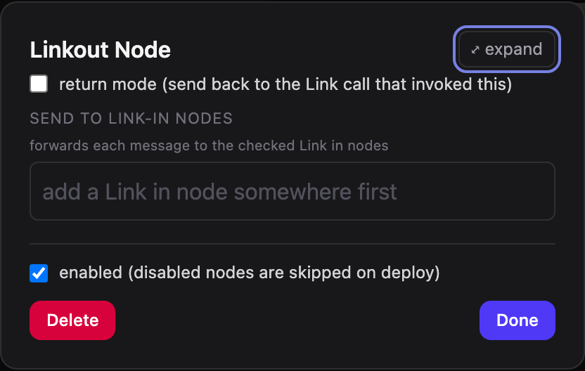</td>
<td><b><code>Link out</code></b> — Sends to the targeted <code>Link in</code> nodes; in <i>return</i> mode, replies to a <code>Link call</code>.</td>
</tr>
<tr>
<td width="320">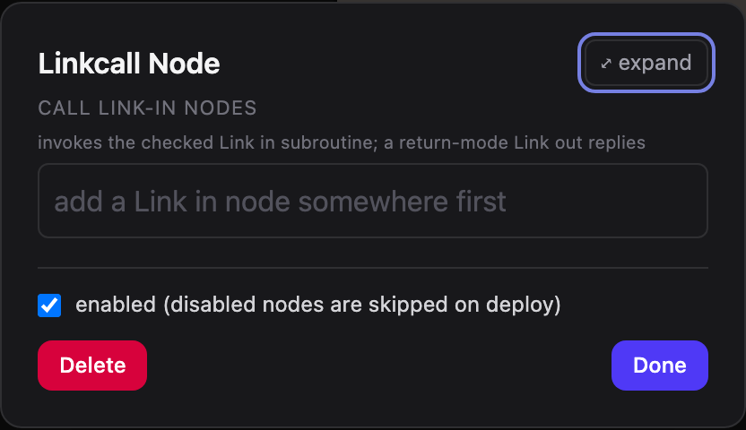</td>
<td><b><code>Link call</code></b> — Calls a <code>Link in</code>-started subroutine and resumes when a return-mode <code>Link out</code> responds — reuse common logic like a function.</td>
</tr>
<tr>
<td width="320">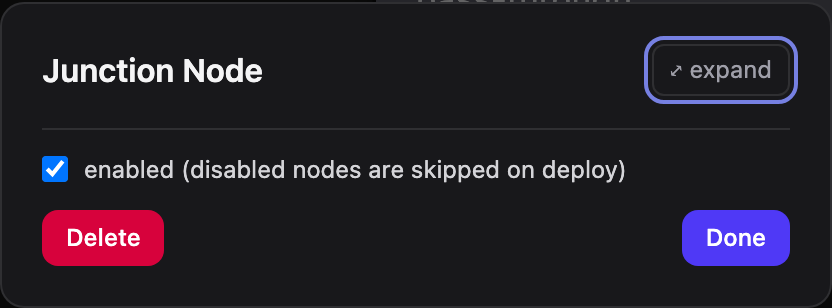</td>
<td><b><code>junction</code></b> — A pass-through wiring point that routes inputs unchanged — gather many wires into one to tidy routing.</td>
</tr>
<tr>
<td width="320">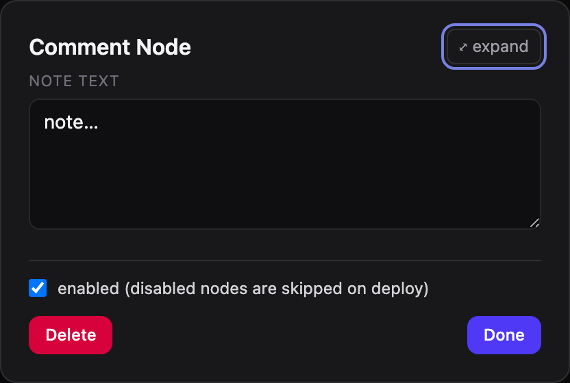</td>
<td><b><code>comment</code></b> — A canvas sticky note. Never deployed — just documents a stretch of flow.</td>
</tr>
</table>

</details>

<details>
<summary><strong>Function</strong> — transform, branch and time messages</summary>

<table>
<tr>
<td width="320">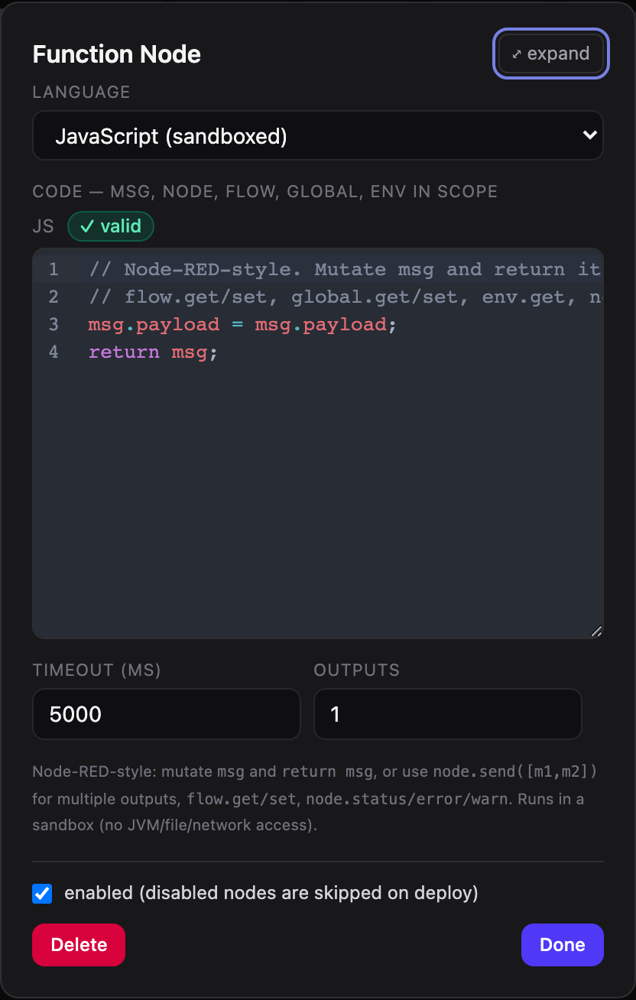</td>
<td><b><code>function</code></b> — Transforms the message with your own code in <b>sandboxed JavaScript</b> (GraalVM, <code>HostAccess.NONE</code>). Live syntax checking in a CodeMirror editor; <code>msg</code>/<code>node</code>/<code>flow</code>/<code>global</code>/<code>env</code> in scope; multiple outputs via <code>node.send([...])</code>. No JVM/file/network access.</td>
</tr>
<tr>
<td width="320">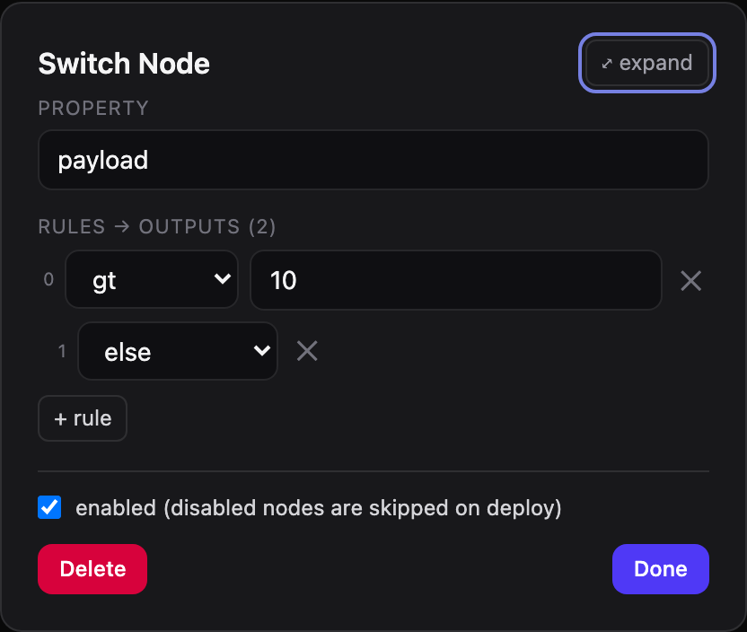</td>
<td><b><code>switch</code></b> — Routes the message to the output port whose rule matches (<code>==</code>, <code>!=</code>, <code>&lt;</code>, <code>&gt;</code>, <code>contains</code>, <code>otherwise</code>, expression). Rules match top-down; #rules = #outputs.</td>
</tr>
<tr>
<td width="320">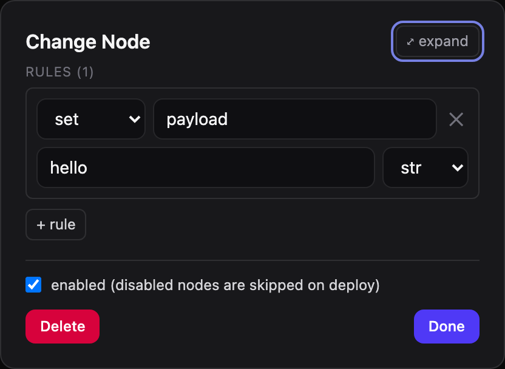</td>
<td><b><code>change</code></b> — Applies <b>set / change / delete / move</b> rules to message properties — simple transforms with no code.</td>
</tr>
<tr>
<td width="320">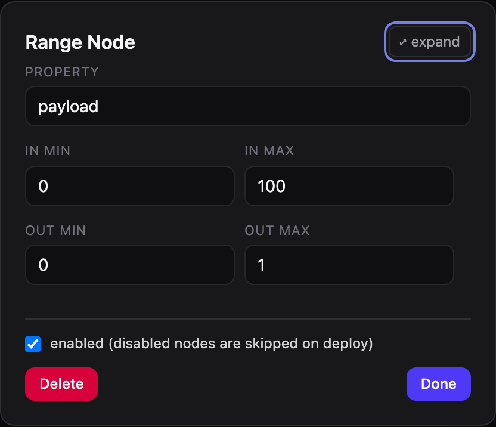</td>
<td><b><code>range</code></b> — Linearly scales a numeric property from one range to another (e.g. ADC <code>0–1023</code> → <code>0–100%</code>), with optional clamping.</td>
</tr>
<tr>
<td width="320">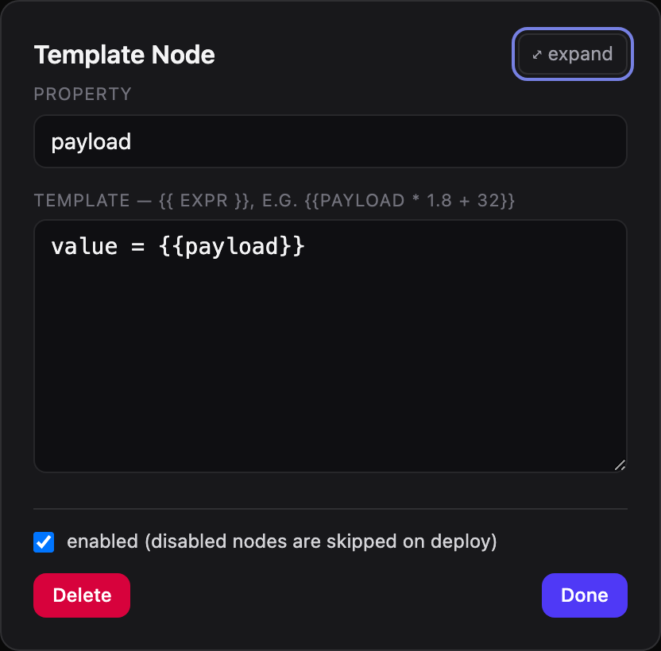</td>
<td><b><code>template</code></b> — Fills a <code>{{ }}</code> template and writes it to a property — assemble strings (alert text, URLs, queries).</td>
</tr>
<tr>
<td width="320">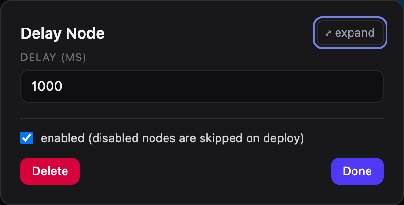</td>
<td><b><code>delay</code></b> — Delays each message by a fixed time — timing / rate control.</td>
</tr>
<tr>
<td width="320">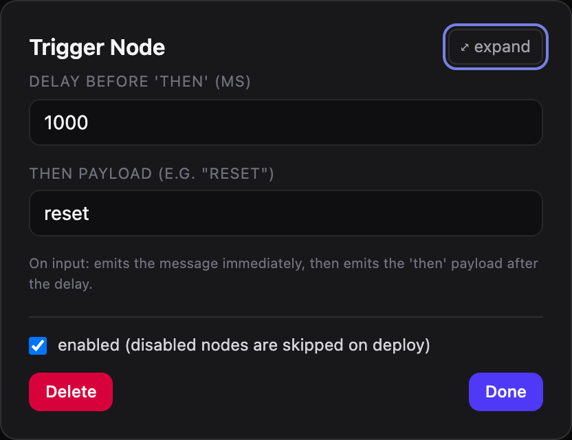</td>
<td><b><code>trigger</code></b> — Emits the input immediately, then emits a set payload once after a delay — watchdog / auto-reset (e.g. "on" now, "reset" in n seconds).</td>
</tr>
<tr>
<td width="320">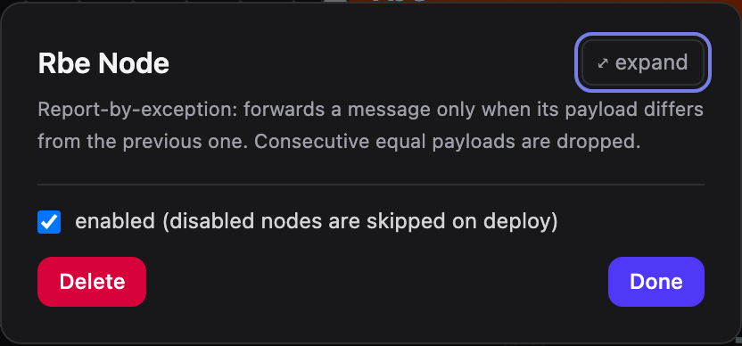</td>
<td><b><code>Filter (rbe)</code></b> — Passes a message only when the value <i>changed</i> (report-by-exception) — suppress duplicates, cut noise and load.</td>
</tr>
<tr>
<td width="320">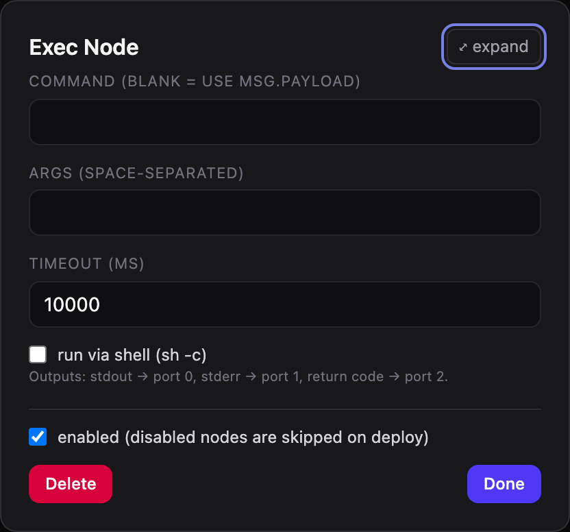</td>
<td><b><code>exec</code></b> — Runs a system command → <code>stdout</code> (port 0), <code>stderr</code> (port 1), exit code (port 2). Shell mode needs a fixed command; <b>ADMIN-only</b> to deploy.</td>
</tr>
</table>

</details>

<details>
<summary><strong>Network</strong> — receive, send and request over the wire</summary>

<table>
<tr>
<td width="320">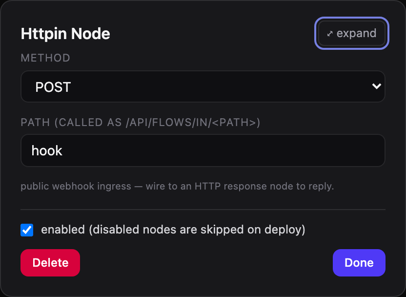</td>
<td><b><code>HTTP in</code></b> — Public webhook inlet — turns <code>POST /api/flows/in/&lt;path&gt;</code> requests into messages (unauthenticated by design). Pair with <code>HTTP response</code> to reply.</td>
</tr>
<tr>
<td width="320">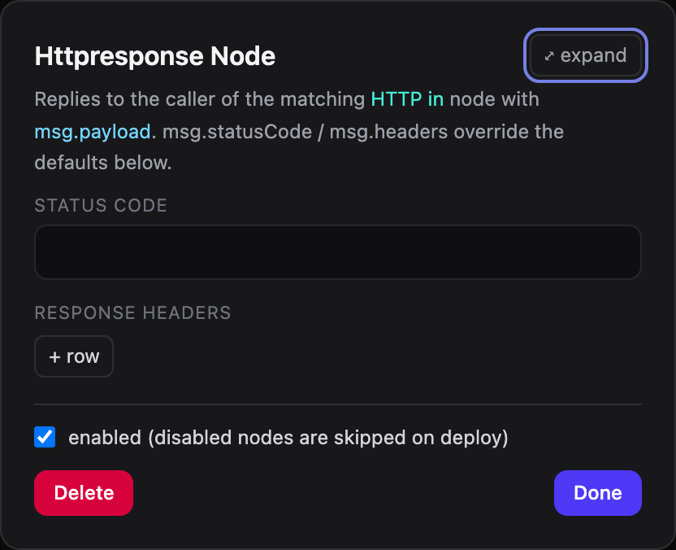</td>
<td><b><code>HTTP response</code></b> — Replies to the paired <code>HTTP in</code> caller with <code>msg.payload</code>, a status code and headers.</td>
</tr>
<tr>
<td width="320">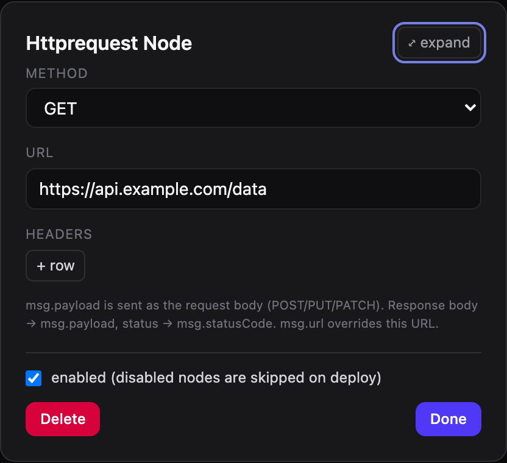</td>
<td><b><code>HTTP request</code></b> — Makes an outbound HTTP request; response body → <code>msg.payload</code>, status → <code>msg.statusCode</code>. Override the URL with <code>msg.url</code>.</td>
</tr>
<tr>
<td width="320">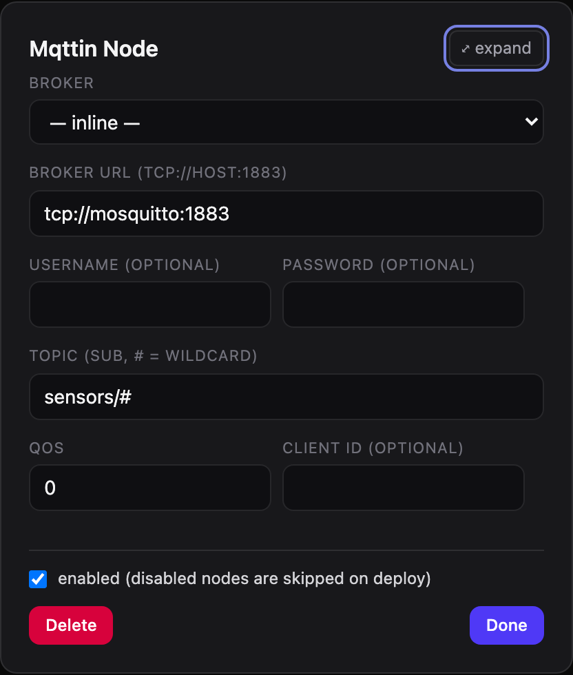</td>
<td><b><code>MQTT in</code></b> — Subscribes to a broker topic and fires a message on each arrival (compose ships a mosquitto broker).</td>
</tr>
<tr>
<td width="320">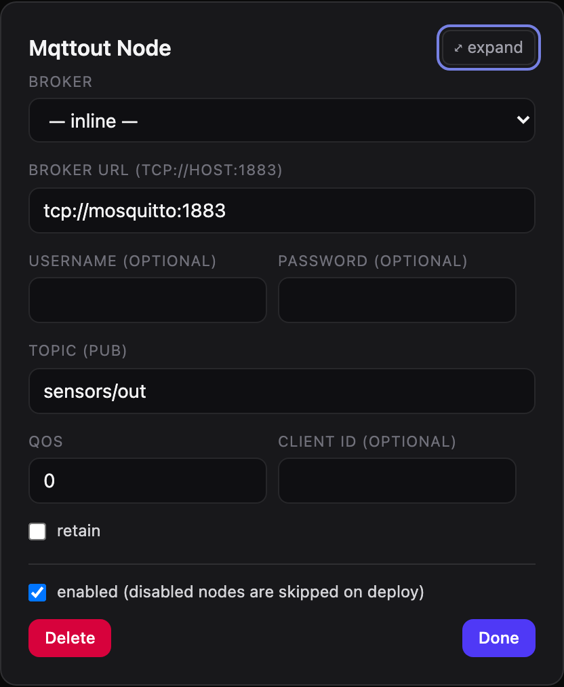</td>
<td><b><code>MQTT out</code></b> — Publishes <code>msg.payload</code> to an MQTT topic.</td>
</tr>
<tr>
<td width="320">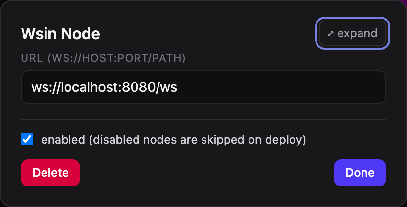</td>
<td><b><code>WebSocket in</code></b> — Connects to a WebSocket URL and fires a message per text frame (auto-reconnect).</td>
</tr>
<tr>
<td width="320">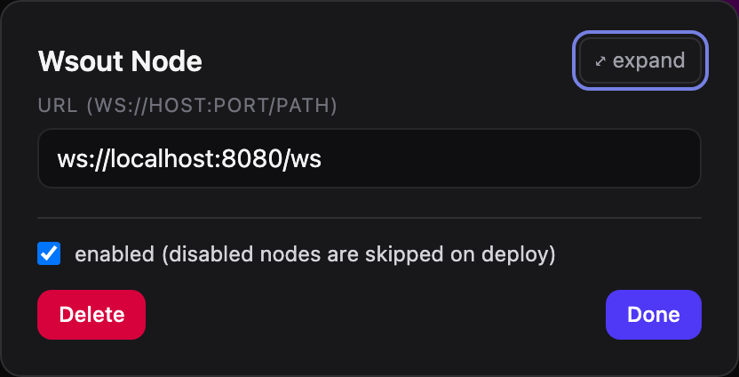</td>
<td><b><code>WebSocket out</code></b> — Sends <code>msg.payload</code> as a WebSocket text frame.</td>
</tr>
<tr>
<td width="320">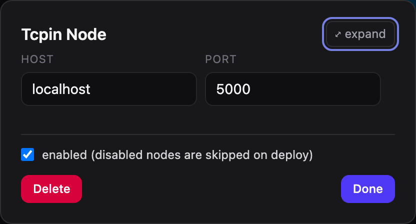</td>
<td><b><code>TCP in</code></b> — Connects to <code>host:port</code> and fires a message per received line (auto-reconnect).</td>
</tr>
<tr>
<td width="320">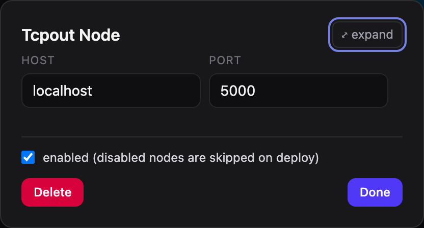</td>
<td><b><code>TCP out</code></b> — Sends <code>msg.payload</code> (+ newline) to a TCP <code>host:port</code>.</td>
</tr>
<tr>
<td width="320">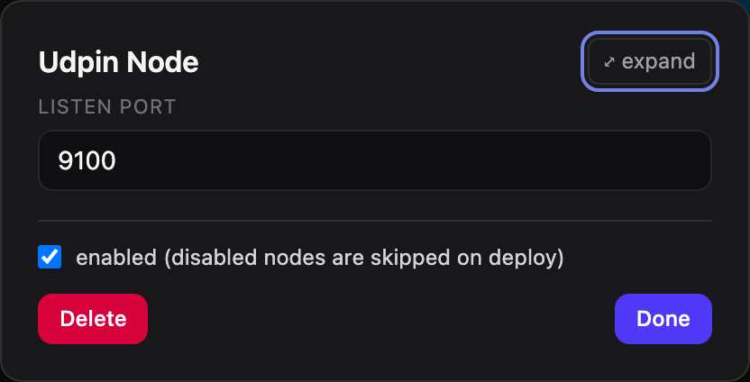</td>
<td><b><code>UDP in</code></b> — Binds a UDP port and emits each received datagram as payload.</td>
</tr>
<tr>
<td width="320">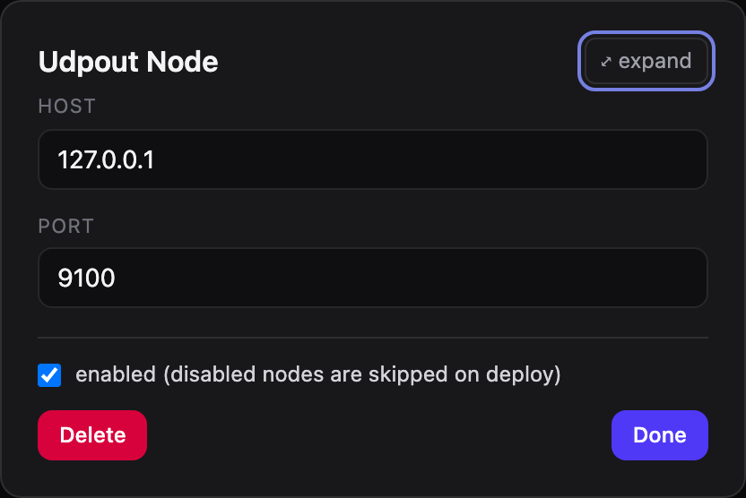</td>
<td><b><code>UDP out</code></b> — Sends <code>msg.payload</code> as a UDP datagram to <code>host:port</code>.</td>
</tr>
<tr>
<td width="320">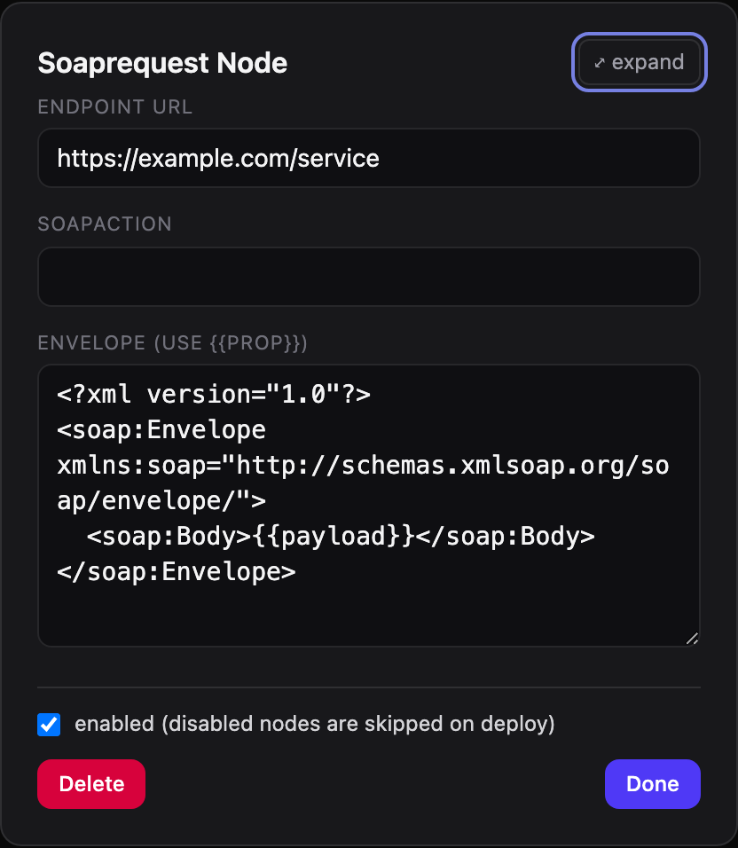</td>
<td><b><code>SOAP request</code></b> — POSTs a templated SOAP envelope (<code>{{prop}}</code> substitution) to an endpoint — legacy SOAP integration.</td>
</tr>
</table>

</details>

<details>
<summary><strong>Sequence</strong> — split, join, sort and batch messages</summary>

<table>
<tr>
<td width="320">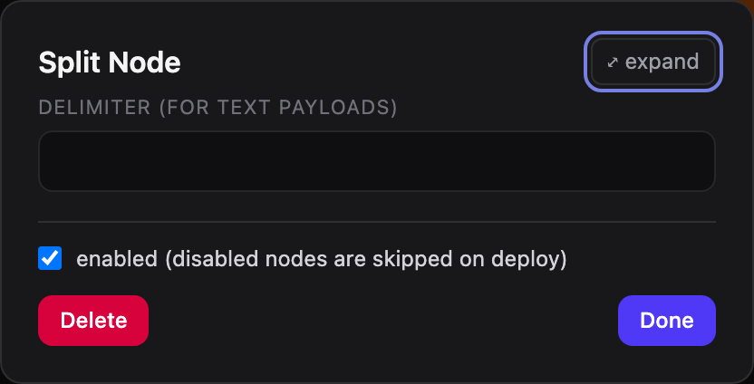</td>
<td><b><code>split</code></b> — Splits an array (or delimited string) into one message per element — process rows/values individually.</td>
</tr>
<tr>
<td width="320"></td>
<td><b><code>join</code></b> — Collects N messages into a single array payload — the inverse of <code>split</code>.</td>
</tr>
<tr>
<td width="320">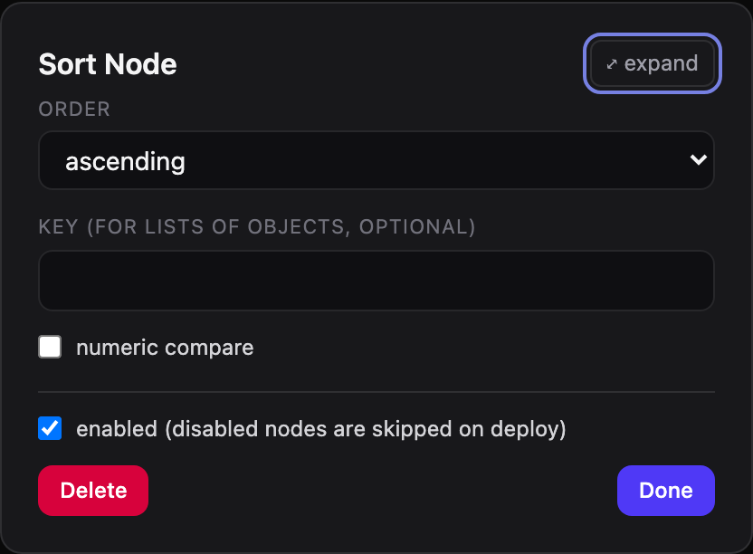</td>
<td><b><code>sort</code></b> — Sorts a list payload (asc/desc, numeric or lexical, optional key).</td>
</tr>
<tr>
<td width="320">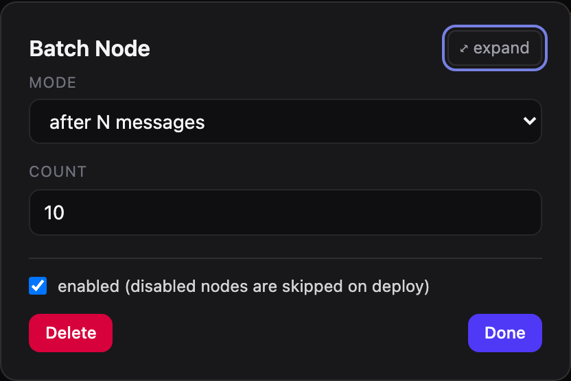</td>
<td><b><code>batch</code></b> — Groups messages into one array — by count or by time interval — for bulk store/send.</td>
</tr>
</table>

</details>

<details>
<summary><strong>Parser</strong> — format conversion</summary>

<table>
<tr>
<td width="320">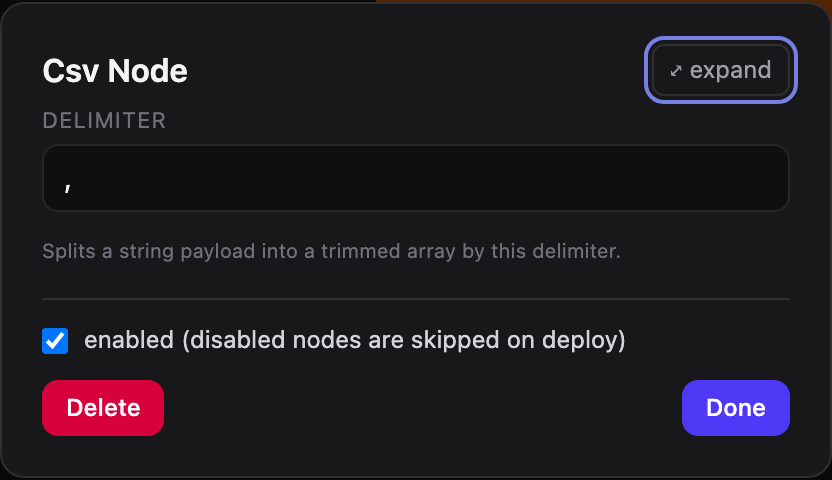</td>
<td><b><code>csv</code></b> — Splits a delimited string into a trimmed array of fields.</td>
</tr>
<tr>
<td width="320"></td>
<td><b><code>json</code></b> — Converts a JSON string ↔ object (auto by payload type, or force parse/stringify).</td>
</tr>
<tr>
<td width="320"></td>
<td><b><code>xml</code></b> — Converts an XML string ↔ nested object.</td>
</tr>
<tr>
<td width="320">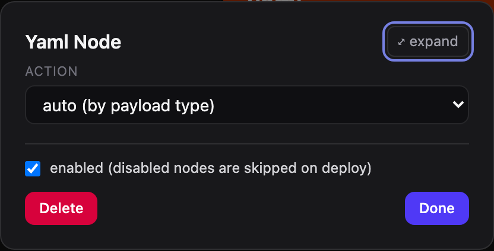</td>
<td><b><code>yaml</code></b> — Converts a YAML string ↔ object (SnakeYAML 2.x — global tags rejected, safe).</td>
</tr>
<tr>
<td width="320">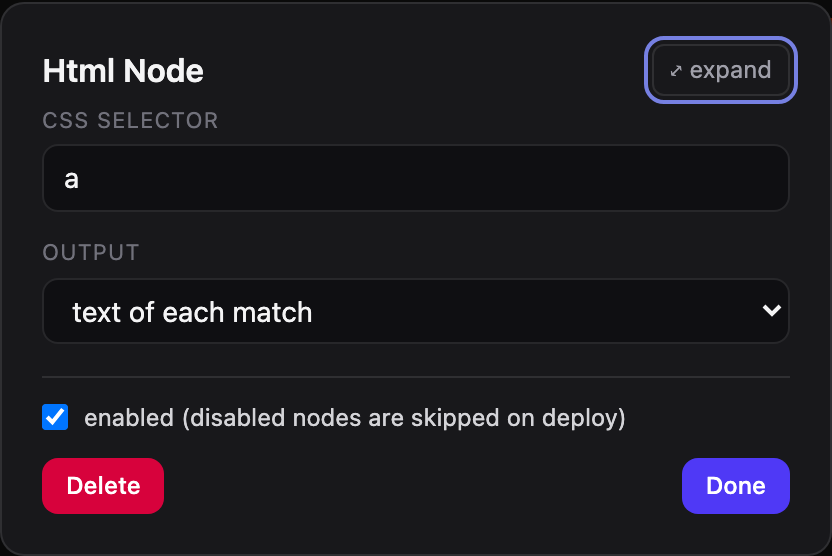</td>
<td><b><code>html</code></b> — Extracts elements from HTML by CSS selector (jsoup) — light scraping.</td>
</tr>
</table>

</details>

<details>
<summary><strong>Storage</strong> — files, historian tags, and pulling from sources ★</summary>

<table>
<tr>
<td width="320">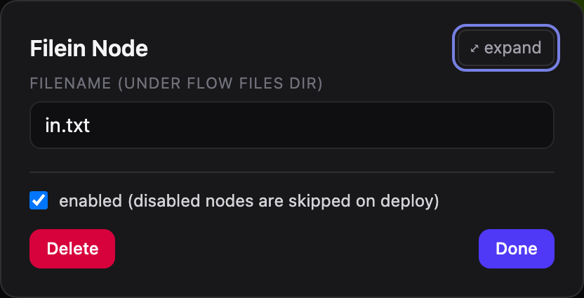</td>
<td><b><code>File in</code></b> — Reads a file into <code>msg.payload</code>. Confined to <code>CHRONOS_FLOW_FILES_DIR</code> (symlink-escape guarded).</td>
</tr>
<tr>
<td width="320">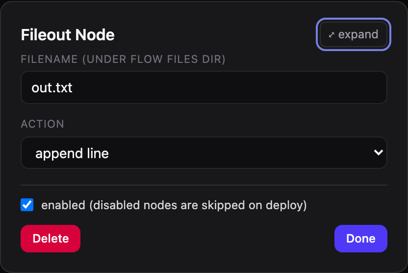</td>
<td><b><code>File out</code></b> — Writes / appends / deletes a file (same sandbox) — log or export results.</td>
</tr>
<tr>
<td width="320">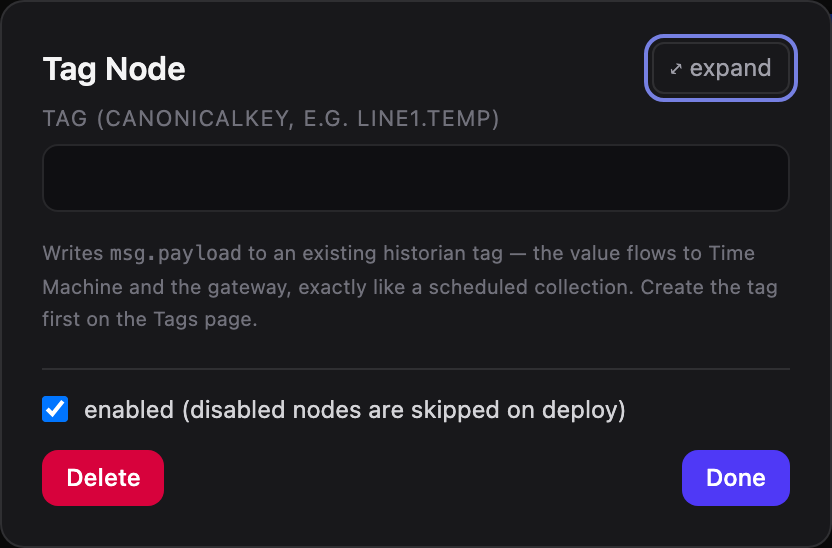</td>
<td><b><code>tag</code> ★</b> — Writes <code>msg.payload</code> into a <b>historian tag</b> (canonicalKey, e.g. <code>line1.temp</code>) → fans out to Time Machine + gateway, exactly like scheduled collection. The terminal node of a flow-authored pipeline. The tag must already exist in <b>Tags</b>.</td>
</tr>
<tr>
<td width="320">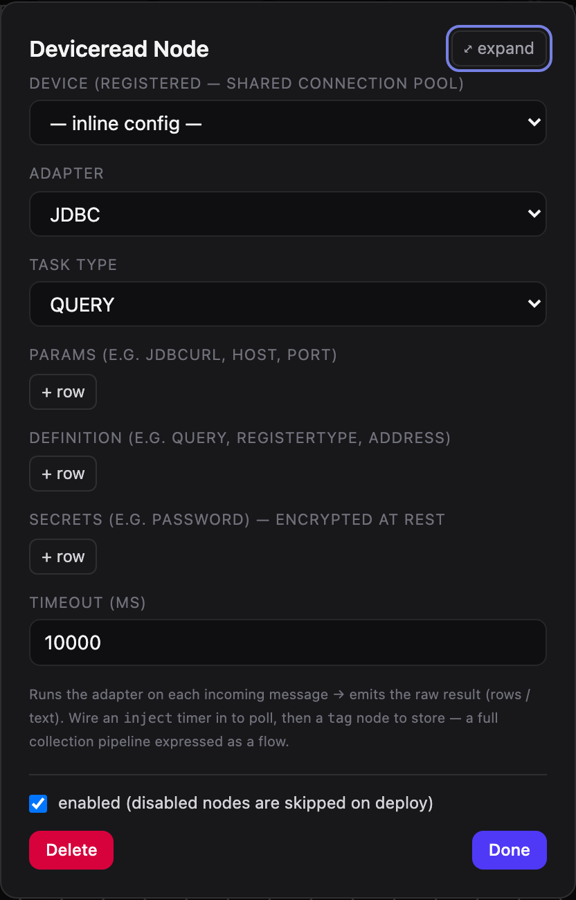</td>
<td><b><code>device read</code> ★</b> — Runs a pull adapter (JDBC / Modbus / shell / file / API) on each incoming message and emits the raw result. Pick a <b>globally-registered device</b> to share one bounded connection pool (vs. inline config, which can fragment pools). <code>inject → device read → function → tag</code> is the canonical collection pattern.</td>
</tr>
</table>

</details>

---

## Project layout

```
backend/
  core-api/        SPI + value objects (pure JDK)
  core-engine/     collection pipeline · current-value cache · SQLite history
  core-flow/       flow graph + node runtime (framework-free)
  app/             Spring Boot: REST · security · scheduling · flow deploy · persistence
  gateway/         WebSocket + protobuf broadcaster
  adapters/        PF4J plugins: adapter-{jdbc,file,shell,script,mqtt,modbus,tcp} (+ adapter-api)
frontend/          React 19 + Vite + Tailwind v4 + React Flow + CodeMirror + ECharts
proto/             protobuf schema for the gateway wire format
sdk/               sdk-java · sdk-python · sdk-dotnet
docs/              architecture · adding-a-protocol · security · screenshots · examples
```

---

## Build & test

**Backend** (compiles & runs on JDK 17 via the Gradle toolchain):

```bash
./gradlew build                 # all modules: compile + unit + Testcontainers integration tests
./gradlew :app:test             # just the app module's tests
./gradlew :app:bootJar          # the runnable Spring Boot jar
./gradlew heavyDbTest           # optional: Oracle + MS-SQL E2E (large container images)
```

Integration tests use **Testcontainers**, so a running Docker daemon is required.

**Frontend:**

```bash
cd frontend
pnpm install
pnpm lint && pnpm build && pnpm test
```

**Rebuild & redeploy a single service:**

```bash
docker compose build frontend && docker compose up -d frontend
docker compose build backend  && docker compose up -d backend
```

---

## Security

- **JWT (HS256)** auth issued at `POST /api/auth/login`; role claim drives **RBAC**
  (ADMIN / OPERATOR / VIEWER).
- **Secrets are never stored in plaintext** — device/flow credentials are **AES-GCM** encrypted at
  rest and masked in API responses.
- The **JavaScript Function node** runs in a GraalVM sandbox (`HostAccess.NONE`, no host classes,
  no file/network access) — the only in-flow code path, so there is no in-process Java compilation.
- `POST /api/flows/in/**` is intentionally public (inbound webhooks for `http in` nodes).
- The `file in` / `file out` nodes are confined to `CHRONOS_FLOW_FILES_DIR` (symlink-escape guarded).

See [`docs/security.md`](docs/security.md) for the full posture.

---

## License

Released under the [MIT License](LICENSE).
